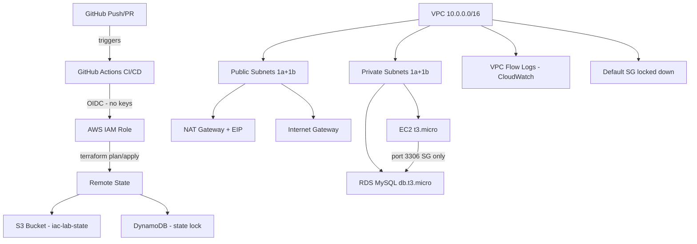

# iac-lab - AWS Infrastructure as Code


A production-grade Terraform IaC project demonstrating cloud infrastructure automation with AI-assisted development using Claude Code.

## Architecture



## Infrastructure

| Resource | Details |
|---|---|
| VPC | 10.0.0.0/16 - ap-southeast-1 |
| Public subnets | 10.0.1.0/24 (1a), 10.0.2.0/24 (1b) |
| Private subnets | 10.0.10.0/24 (1a), 10.0.11.0/24 (1b) |
| EC2 | t3.micro - IMDSv2, encrypted gp3, private subnet |
| RDS | MySQL 8.0 - db.t3.micro, encrypted, private subnet |
| Remote state | S3 + DynamoDB locking |
| Flow logs | CloudWatch - 30 day retention |

## CI/CD Pipeline

### On every Pull Request

- terraform fmt check
- terraform validate
- TFLint - lint rules and best practices
- tfsec - security misconfiguration scan
- terraform plan - shows exactly what will change in AWS
- Claude AI - reads the plan, posts plain-English summary
- Infracost - calculates monthly cost estimate per resource

### On merge to main

- terraform apply via OIDC - no AWS keys stored anywhere

### Every Monday at 1am UTC

- Drift detection - compares live AWS state against Terraform code
- Claude AI - analyses any drift found
- GitHub Issue created automatically if drift detected

## What Appears on Every PR

**1. Infracost report**
- Monthly cost estimate per resource (EC2, RDS, NAT gateway)
- Total monthly cost change introduced by the PR
- 34 cloud resources detected, 6 estimated, 27 free in this project

**2. Claude AI Plan Summary**
- What resources are changing in plain English
- Risk level: low / medium / high
- Cost impact assessment
- Full terraform plan in collapsible section

**3. Security scan results**
- tfsec findings with severity levels

## Claude Code Concepts Used

| Concept | Implementation |
|---|---|
| CLAUDE.md | Project memory - naming, tags, module standards, behaviour rules |
| Skills | /terraform-generate - enforces all HCL standards automatically |
| Skills | /security-review - CRITICAL/WARNING/PASSED structured output |
| Hooks | pre-write: terraform fmt on every .tf save |
| Hooks | pre-commit: blocks .tfstate and .tfvars commits |
| Hooks | post-apply: CLAUDE.md self-update reminder |
| MCP server | Terraform MCP - reads live project structure |
| MCP server | AWS MCP - queries live infrastructure |

## Security Standards

- OIDC federation - no long-lived AWS keys anywhere
- IMDSv2 enforced on EC2
- All storage encrypted at rest (S3, EBS, RDS)
- RDS: deletion_protection, skip_final_snapshot=false, 7-day backups
- Security groups: least privilege, separate rules, no 0.0.0.0/0 ingress on RDS
- VPC flow logs capturing ALL traffic
- Default security group locked down
- prevent_destroy on all stateful resources (S3, DynamoDB, RDS, VPC)

## Key Terraform Patterns

| Pattern | Why |
|---|---|
| for_each with stable string keys | Prevents resource recreation when list items are removed |
| prevent_destroy on stateful resources | Hard guardrail - cannot be bypassed with yes |
| merge(var.tags, { Name = ... }) | Every resource gets a Name tag for cost allocation |
| ignore_changes = [rule] on S3 lifecycle | AWS API returns rules in unpredictable order |
| sensitive = true on outputs | Credentials never appear in Terraform logs |
| Separate aws_security_group_rule resources | Independent management without replacing the SG |
| OIDC instead of long-lived keys | Temporary 15-minute credentials, nothing to rotate |

## Module Structure

```
modules/
+-- s3/        - S3 bucket with versioning, encryption, lifecycle rules
+-- dynamodb/  - DynamoDB lock table, wired from S3 module output
+-- vpc/       - VPC, subnets, IGW, NAT, route tables, flow logs
+-- ec2/       - EC2 in private subnet, IMDSv2, encrypted volume
+-- rds/       - RDS MySQL, private subnet, SG from EC2 only
```

## Cost Estimation

This project uses Infracost to estimate monthly AWS costs on every PR.
- 34 cloud resources detected
- 6 resources with monthly costs (EC2, RDS, NAT gateway, EIP, CloudWatch)
- 27 resources are free (subnets, route tables, security groups, IAM roles)
- Infracost posts a detailed breakdown on every PR

## Tools

Terraform 1.7+ - AWS CLI - Claude Code 2.1.104 - GitHub Actions - TFLint - tfsec - Infracost - uv - Python 3

## Deployment

Region: ap-southeast-1
State backend: S3 with DynamoDB locking
Environments: dev / prod via Terraform workspaces

## Related

Plugin: https://github.com/kkumarb310/devops-iac-plugin
