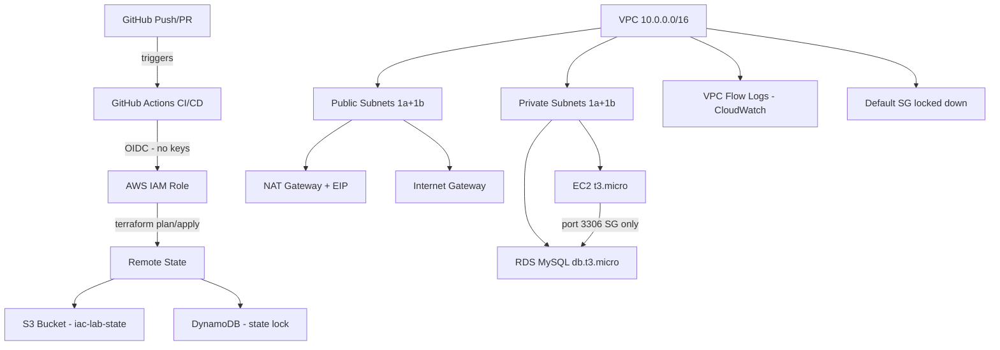

# iac-lab - AWS Infrastructure as Code


A production-grade Terraform IaC project demonstrating cloud infrastructure automation with AI-assisted development using Claude Code.

## Architecture



## Infrastructure

| Resource | Details |
|---|---|
| VPC | 10.0.0.0/16 - ap-southeast-1 |
| Public subnets | 10.0.1.0/24 (1a), 10.0.2.0/24 (1b) |
| Private subnets | 10.0.10.0/24 (1a), 10.0.11.0/24 (1b) |
| EC2 | t3.micro - IMDSv2, encrypted gp3, private subnet |
| RDS | MySQL 8.0 - db.t3.micro, encrypted, private subnet |
| Remote state | S3 + DynamoDB locking |
| Flow logs | CloudWatch - 30 day retention |

## Approach Comparison

How four common ways of provisioning AWS infrastructure stack up against each other. This project uses **Terraform + Claude Code + devops-iac-plugin** — column 4.

| Capability | AWS CLI | Terraform (alone) | Terraform + Claude Code | Terraform + Claude + Plugin (this project) |
|---|---|---|---|---|
| **Provisioning model** | Imperative — one API call at a time | Declarative — desired state | Declarative + AI-assisted authoring | Declarative + AI + enforced standards |
| **Idempotency** | No — re-running creates duplicates | Yes — state tracks every resource | Yes | Yes |
| **State management** | None — AWS is the source of truth | Local or remote (S3+DynamoDB) | Same as Terraform | Remote state baked in (S3 + DynamoDB lock) |
| **Drift detection** | Manual diffing only | `terraform plan` shows drift | Plan + Claude reads & explains it | Weekly automated drift detection + Claude analysis + GitHub Issue |
| **Multi-resource dependencies** | You order them by hand | DAG resolves automatically | DAG + Claude suggests `depends_on` where AWS can't infer | Same + plugin enforces `depends_on` patterns |
| **Code review on changes** | None — script runs blind | `terraform plan` text only | Claude reviews the plan in chat | PR gets Claude AI summary + tfsec + Infracost automatically |
| **Security scanning** | Manual or external tooling | External (tfsec, Checkov) | Claude reviews + external tools | `/security-review` skill + tfsec on every PR |
| **Cost estimation** | None — surprise on the bill | None native | Claude can estimate roughly | Infracost runs on every PR with per-resource breakdown |
| **Standards enforcement** | None | Tribal knowledge / wiki | Per-conversation reminders | `CLAUDE.md` + Skills + Hooks enforce standards permanently |
| **Onboarding new engineers** | Days — read docs and runbooks | Days — learn HCL + project conventions | Hours — Claude explains as you go | Minutes — plugin install transfers all standards instantly |
| **Auto-formatting** | N/A | `terraform fmt` manual | Claude formats on suggestion | Pre-write hook runs `terraform fmt` on every save |
| **Dangerous-commit blocking** | N/A | None | Claude warns | Pre-commit hook blocks `.tfstate` and `.tfvars` automatically |
| **Plain-English PR summaries** | None | None | Manual ask | Automatic on every PR via Claude API in CI |
| **Reproducibility across teams** | Low — bash scripts diverge | High — same HCL = same infra | High | Highest — plugin distributes the same standards to every repo |
| **Disaster recovery** | Re-run scripts manually | `terraform apply` rebuilds | Same | Same + `prevent_destroy` guardrails enforced by plugin |
| **Speed of authoring new module** | N/A (no module concept) | 30-60 min from scratch | 10-20 min with Claude help | 2-5 min with `/terraform-generate` skill |
| **Risk of forgotten guardrail** (e.g. missing `prevent_destroy`) | High | High | Medium | Low — Skills auto-include them |
| **Audit trail** | CloudTrail only | Git + CloudTrail | Git + CloudTrail | Git + CloudTrail + PR comments + Infracost history |
| **Best for** | One-off ad-hoc tasks | Solo or small-team IaC | Faster IaC authoring | Team IaC with consistent standards |

### When each approach fits

- **AWS CLI** — quick exploration, ad-hoc tasks, scripts that won't be re-run.
- **Terraform alone** — small teams who already share a strong convention culture.
- **Terraform + Claude Code** — solo developers who want faster authoring and richer reviews without changing tooling.
- **Terraform + Claude + Plugin** *(this project)* — teams who want the same standards enforced across every repo, every PR, every engineer — without writing review checklists.

## Major Features

**Infrastructure**
- 3-tier AWS layout: VPC + EC2 + RDS, all private-subnet by default
- Multi-AZ public/private subnets in `ap-southeast-1`
- Remote state with S3 bucket + DynamoDB locking
- VPC Flow Logs to CloudWatch with 30-day retention
- Workspaces for `dev` / `prod` environment isolation

**Security**
- OIDC federation for CI/CD — no long-lived AWS keys
- IMDSv2 enforced on EC2
- Encryption at rest on every store (S3, EBS, RDS)
- Least-privilege security groups (RDS reachable only from EC2 SG)
- `prevent_destroy` on all stateful resources
- Default security group locked down
- Sensitive variables marked `sensitive = true`

**Developer experience**
- AI-assisted authoring through Claude Code
- `CLAUDE.md` carries project standards into every session
- `/terraform-generate` skill creates compliant modules in seconds
- `/security-review` skill produces structured CRITICAL/WARNING/PASSED output
- Pre-write hook runs `terraform fmt` automatically
- Pre-commit hook blocks `.tfstate` and `.tfvars` from being committed
- Post-apply hook reminds Claude to update `CLAUDE.md`

**CI/CD**
- PR pipeline: fmt + validate + TFLint + tfsec + plan + Claude summary + Infracost
- Deploy pipeline: `terraform apply` via OIDC on merge to `main`
- Weekly drift detection with Claude analysis (auto-creates GitHub Issue)
- Plain-English plan summaries on every PR via Claude API

**Cost & FinOps**
- Infracost monthly estimate per resource on every PR
- 34 resources tracked, 6 with monthly cost, 27 free-tier
- Cost diff visible before merge — no bill-shock surprises

## Key Project Decisions

Decisions captured here are intentional and load-bearing — changing one of them would change project behavior.

| # | Decision | Why |
|---|---|---|
| 1 | **Terraform over CloudFormation / CDK / Pulumi** | Largest ecosystem, multi-cloud-portable, first-class state model, easiest hire pool |
| 2 | **AWS provider `~> 5.0`, Terraform `>= 1.7.0`** | Stable, current LTS feature set (moved blocks, optional object attributes) |
| 3 | **Remote state in S3 + DynamoDB lock** | Industry default; avoids local state corruption and concurrent-apply races |
| 4 | **Workspaces (`dev` / `prod`) instead of separate state files** | Single codebase, isolated state per env, tags injected via `local.workspace_tags` |
| 5 | **OIDC federation for GitHub Actions** | Zero long-lived keys; 15-min temporary credentials per run |
| 6 | **3-tier AWS pattern (VPC + EC2 + RDS)** | Closest to real production workloads; exercises networking, IAM, secrets, encryption |
| 7 | **Private-subnet workloads + NAT Gateway** | Mirrors enterprise patterns; no direct internet exposure for compute or DB |
| 8 | **`for_each` with stable string keys, never `count`** | `count` causes resource recreation when items are removed — destructive on stateful resources |
| 9 | **`prevent_destroy` on every stateful resource** | Hard guardrail; cannot be bypassed by typing `yes` on a destroy plan |
| 10 | **Separate `aws_security_group_rule` resources** | Lets rules be added/removed independently without replacing the whole SG |
| 11 | **`merge(var.tags, { Name = ... })` everywhere** | Every resource gets a `Name` tag for cost-allocation and console UX |
| 12 | **`local.workspace_tags` instead of hardcoded `env`** | Ensures `env` tag always matches the active workspace |
| 13 | **`sensitive = true` on credentials** | Prevents passwords appearing in `terraform plan` / CI logs |
| 14 | **`ignore_changes = [rule]` on S3 lifecycle** | AWS API returns lifecycle rules in unstable order — without this, every plan shows fake drift |
| 15 | **`timeouts` blocks on slow APIs (S3 lifecycle, NAT, RDS)** | These APIs routinely exceed Terraform's default 20-min timeout |
| 16 | **No `provider`/`terraform` blocks inside modules** | Modules with provider blocks cannot be reused across regions/accounts |
| 17 | **Random suffix on globally unique resources (S3 buckets)** | Avoids global-namespace collisions across all AWS customers |
| 18 | **`CLAUDE.md` as the project's single source of standards** | Every Claude session loads it; standards never drift between engineers |
| 19 | **Skills for repeatable workflows (`terraform-generate`, `security-review`)** | Encodes "how we do things" so output is predictable across sessions |
| 20 | **Hooks for non-negotiable behaviors (fmt, block-state, post-apply)** | Hooks enforce policy at the harness level — Claude can't forget |
| 21 | **Claude AI plan summaries in PRs** | Non-engineers (PMs, leads) can review infra changes without reading HCL |
| 22 | **Weekly drift detection cron** | Catches manual console changes before they cause an incident |
| 23 | **Infracost on every PR** | NAT gateway and RDS can cause bill surprises — visible before merge |
| 24 | **Plugin extracted into [`devops-iac-plugin`](https://github.com/kkumarb310/devops-iac-plugin)** | Standards become portable — drop into any other Terraform repo and inherit them |
| 25 | **Python (not curl) for Claude API call in CI** | `curl` failed on special characters in plan output; Python handles JSON encoding cleanly |

## CI/CD Pipeline

### On every Pull Request

- terraform fmt check
- terraform validate
- TFLint - lint rules and best practices
- tfsec - security misconfiguration scan
- terraform plan - shows exactly what will change in AWS
- Claude AI - reads the plan, posts plain-English summary
- Infracost - calculates monthly cost estimate per resource

### On merge to main

- terraform apply via OIDC - no AWS keys stored anywhere

### Every Monday at 1am UTC

- Drift detection - compares live AWS state against Terraform code
- Claude AI - analyses any drift found
- GitHub Issue created automatically if drift detected

## What Appears on Every PR

**1. Infracost report**
- Monthly cost estimate per resource (EC2, RDS, NAT gateway)
- Total monthly cost change introduced by the PR
- 34 cloud resources detected, 6 estimated, 27 free in this project

**2. Claude AI Plan Summary**
- What resources are changing in plain English
- Risk level: low / medium / high
- Cost impact assessment
- Full terraform plan in collapsible section

**3. Security scan results**
- tfsec findings with severity levels

## Claude Code Concepts Used

| Concept | Implementation |
|---|---|
| CLAUDE.md | Project memory - naming, tags, module standards, behaviour rules |
| Skills | /terraform-generate - enforces all HCL standards automatically |
| Skills | /security-review - CRITICAL/WARNING/PASSED structured output |
| Hooks | pre-write: terraform fmt on every .tf save |
| Hooks | pre-commit: blocks .tfstate and .tfvars commits |
| Hooks | post-apply: CLAUDE.md self-update reminder |
| MCP server | Terraform MCP - reads live project structure |
| MCP server | AWS MCP - queries live infrastructure |

## Security Standards

- OIDC federation - no long-lived AWS keys anywhere
- IMDSv2 enforced on EC2
- All storage encrypted at rest (S3, EBS, RDS)
- RDS: deletion_protection, skip_final_snapshot=false, 7-day backups
- Security groups: least privilege, separate rules, no 0.0.0.0/0 ingress on RDS
- VPC flow logs capturing ALL traffic
- Default security group locked down
- prevent_destroy on all stateful resources (S3, DynamoDB, RDS, VPC)

## Key Terraform Patterns

| Pattern | Why |
|---|---|
| for_each with stable string keys | Prevents resource recreation when list items are removed |
| prevent_destroy on stateful resources | Hard guardrail - cannot be bypassed with yes |
| merge(var.tags, { Name = ... }) | Every resource gets a Name tag for cost allocation |
| ignore_changes = [rule] on S3 lifecycle | AWS API returns rules in unpredictable order |
| sensitive = true on outputs | Credentials never appear in Terraform logs |
| Separate aws_security_group_rule resources | Independent management without replacing the SG |
| OIDC instead of long-lived keys | Temporary 15-minute credentials, nothing to rotate |

## Module Structure

```
modules/
+-- s3/        - S3 bucket with versioning, encryption, lifecycle rules
+-- dynamodb/  - DynamoDB lock table, wired from S3 module output
+-- vpc/       - VPC, subnets, IGW, NAT, route tables, flow logs
+-- ec2/       - EC2 in private subnet, IMDSv2, encrypted volume
+-- rds/       - RDS MySQL, private subnet, SG from EC2 only
```

Module wiring (output → input):
```
s3_state.bucket_name      → dynamodb_lock.state_bucket_name
vpc.vpc_id                → ec2.vpc_id, rds.vpc_id
vpc.private_subnet_ids    → ec2.private_subnet_ids, rds.private_subnet_ids
ec2.security_group_id     → rds.app_security_group_id
```

## Cost Estimation

This project uses Infracost to estimate monthly AWS costs on every PR.
- 34 cloud resources detected
- 6 resources with monthly costs (EC2, RDS, NAT gateway, EIP, CloudWatch)
- 27 resources are free (subnets, route tables, security groups, IAM roles)
- Infracost posts a detailed breakdown on every PR

## Tools

Terraform 1.7+ - AWS CLI - Claude Code 2.1.104 - GitHub Actions - TFLint - tfsec - Infracost - uv - Python 3

## Deployment

Region: ap-southeast-1
State backend: S3 with DynamoDB locking
Environments: dev / prod via Terraform workspaces

## Related

Plugin: https://github.com/kkumarb310/devops-iac-plugin
