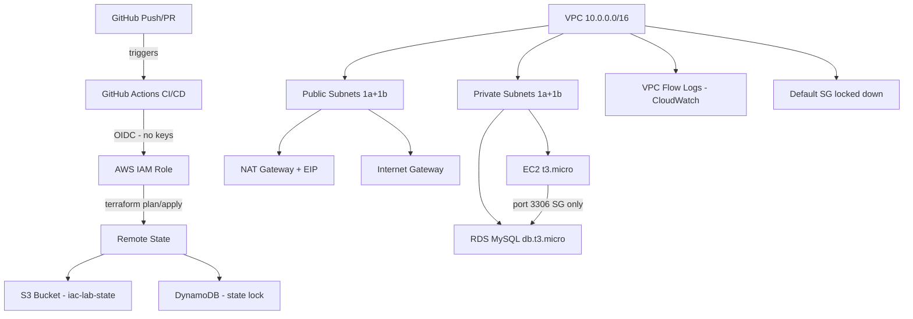

# iac-lab — AWS Infrastructure as Code

A production-grade Terraform IaC project demonstrating cloud infrastructure automation with AI-assisted development using Claude Code.

## Architecture

## Infrastructure

| Resource | Details |
|---|---|
| VPC | 10.0.0.0/16 — ap-southeast-1 |
| Public subnets | 10.0.1.0/24 (1a), 10.0.2.0/24 (1b) |
| Private subnets | 10.0.10.0/24 (1a), 10.0.11.0/24 (1b) |
| EC2 | t3.micro — IMDSv2, encrypted gp3, private subnet |
| RDS | MySQL 8.0 — db.t3.micro, encrypted, private subnet |
| Remote state | S3 + DynamoDB locking |
| Flow logs | CloudWatch — 30 day retention |

## Claude Code concepts used

| Concept | Implementation |
|---|---|
| CLAUDE.md | Project memory — naming, tags, module standards, behaviour rules |
| Skills | /terraform-generate — enforces all HCL standards automatically |
| Skills | /security-review — CRITICAL/WARNING/PASSED structured output |
| Hooks | pre-write: terraform fmt on every .tf save |
| Hooks | pre-commit: blocks .tfstate and .tfvars commits |
| Hooks | post-apply: CLAUDE.md self-update reminder |
| MCP server | Terraform MCP — reads live project structure |
| MCP server | AWS MCP — queries live infrastructure |

## CI/CD pipeline
PR opened  → fmt + TFLint + tfsec + terraform plan → posted as PR comment
PR merged  → terraform apply via OIDC (no AWS keys in GitHub)
## Security standards

- OIDC federation — no long-lived AWS keys anywhere
- IMDSv2 enforced on EC2
- All storage encrypted at rest (S3, EBS, RDS)
- RDS: deletion_protection, skip_final_snapshot=false, 7-day backups
- Security groups: least privilege, separate rules, no 0.0.0.0/0 ingress on RDS
- VPC flow logs capturing ALL traffic
- Default security group locked down
- prevent_destroy on all stateful resources

## Module structure
modules/
├── s3/        — S3 bucket with versioning, encryption, lifecycle rules
├── dynamodb/  — DynamoDB lock table, wired from S3 module output
├── vpc/       — VPC, subnets, IGW, NAT, route tables, flow logs
├── ec2/       — EC2 in private subnet, IMDSv2, encrypted volume
└── rds/       — RDS MySQL, private subnet, SG from EC2 only

## Tools

Terraform 1.7+ · AWS CLI · Claude Code 2.1.104 · GitHub Actions · TFLint · tfsec · uv

## AWS account

Region: ap-southeast-1
State backend: S3 with DynamoDB locking
Environments: dev / prod via Terraform workspaces